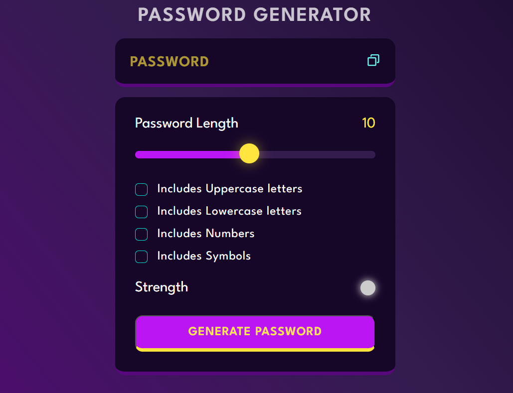

# Password Generator App



## Table of Contents
- [Description](#description)
- [Features](#features)
- [Installation](#installation)
- [Usage](#usage)
- [How it Works](#how-it-works)
- [Contributing](#contributing)
- [License](#license)

## Description

The Password Generator App is a simple web application built using HTML, CSS, and JavaScript. It allows users to generate strong and secure passwords with customizable options.

## Features

- **Password Length:** Choose the length of the password (between 8 and 128 characters).
- **Character Types:** Include or exclude uppercase letters, lowercase letters, numbers, and special characters.
- **Generate Password:** Click the "Generate Password" button to create a random password based on the selected options.
- **Copy to Clipboard:** Easily copy the generated password to the clipboard with the "Copy to Clipboard" button.

## Installation

1. Clone the repository:

    ```bash
    git clone https://github.com/your-username/password-generator-app.git
    ```

2. Navigate to the project directory:

    ```bash
    cd password-generator-app
    ```

3. Open `index.html` in your preferred web browser.

## Usage

1. Open `index.html` in your web browser.
2. Configure the password options (length and character types).
3. Click the "Generate Password" button.
4. Click the "Copy to Clipboard" button to copy the generated password.

## How it Works

The app uses JavaScript to generate a random password based on user-selected options. It combines characters from the selected character types and ensures that the password meets the specified length criteria.

## Contributing

If you would like to contribute to the project, please follow these steps:

1. Fork the repository.
2. Create a new branch for your feature or bug fix.
3. Make your changes and submit a pull request.

## License

This project is licensed under the [MIT License](LICENSE).
